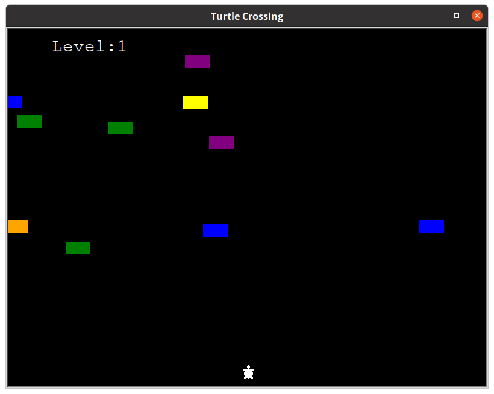

<h1>Turtle Crossing</h1>

Get your turtle across the street before he gets hit by a car! This one uses the Turtle Graphics library in python and features progressively difficult levels. Turtle also decided to execute his crossing at 'nigthttime' hoping there'd be less cars. Oh well! 
 

In a future update, I'd love the cars to change speed independently of one another to add to the challenge factor.

      
=======
